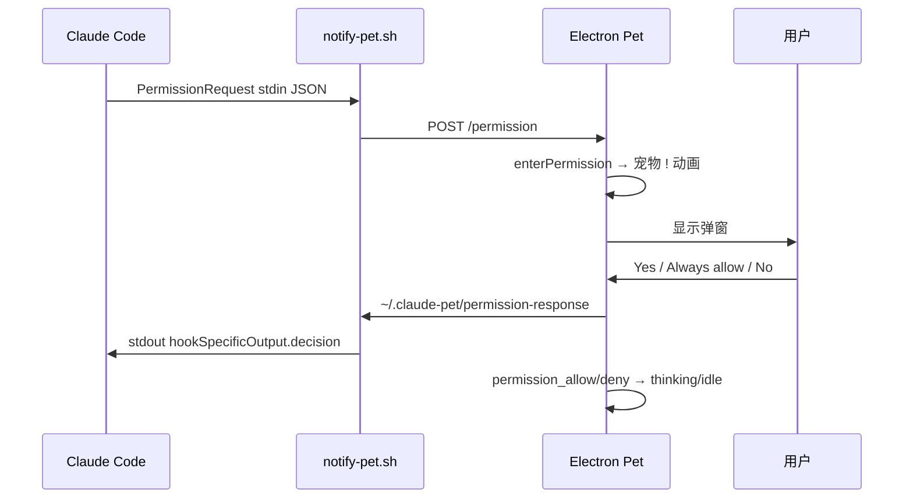

# Claude Pet 开发文档

> 本文档记录 Claude Pet 桌宠插件的架构、动画系统、权限互动与本地开发方式。  
> 最后更新：2026-06-08（版本更新 + 跨平台 Hook + 安装脚本修复）

## 1. 项目概述

Claude Pet 是 Claude Code 的桌面插件：通过 Hook 感知 Claude 的运行状态，在透明 Electron 窗口中渲染 **Claude Code 终端吉祥物 Clawd**，并在需要用户授权时弹出与 Claude Code 一致的权限对话框。

**核心能力：**

- 7 种工具状态实时动画（读文件、搜索、思考、写代码、执行命令、错误）
- 3 种权限互动状态（等待确认、允许反馈、拒绝反馈）
- 状态间 6 帧过渡动画（约 600ms）
- 权限弹窗对齐 Claude Code `PermissionRequest` 数据（Yes / Always allow… / No）
- **版本自动更新检查** — 每日检查 GitHub Releases，一键更新弹窗
- **跨平台纯 Node.js Hook** — 无需 Git Bash，仅需 Node.js 18+
- 独立 Demo 页面，可预览全部状态与权限样例

---

## 2. 系统架构

```
Claude Code
  │
  ├─ PreToolUse / PostToolUse / PostToolUseFailure / Stop
  │     └─ hooks/notify-pet.sh → POST /status
  │
  ├─ Notification (permission_prompt)
  │     └─ notify-pet.sh permission-notify → POST /status { permission }
  │
  └─ PermissionRequest  ← 阻塞式，等待用户选择
        └─ notify-pet.sh permission-request
              ├─ POST /permission  （Electron 显示弹窗）
              └─ 轮询 ~/.claude-pet/permission-response
                    └─ stdout 返回 hookSpecificOutput.decision

Electron (electron/)
  ├─ main.js          HTTP 服务 + 窗口 + IPC + 版本检查调度
  ├─ preload.js       contextBridge（新增 update IPC）
  ├─ renderer.js      状态机 + 10 FPS 动画循环 + 更新事件
  ├─ state-machine.js FSM（10 状态）
  ├─ sprites.js       Clawd 渲染 + 道具 + PetAnimator
  ├─ permission-format.js  权限文案/选项格式化
  ├─ permission-dialog.js  动态权限 UI
  ├─ update-checker.js     GitHub 版本检查 + git pull / npm install
  ├─ update-dialog.js      更新提示 UI（蓝色主题）
  └─ speech-bubble.js 工具状态气泡
```

### 通信端口

- 随机端口写入 `~/.claude-pet/port`
- 权限响应写入 `~/.claude-pet/permission-response`（供 Hook 脚本读取）

| 端点 | 方法 | 用途 |
|------|------|------|
| `/status` | POST | 更新工具状态 `{ state, detail }` |
| `/permission` | POST | 触发权限弹窗（PermissionRequest 完整 payload） |
| `/health` | GET | 健康检查 |

---

## 3. 吉祥物渲染（sprites.js）

### 3.1 视觉来源

角色基于 Claude Code 终端 `An()` 组件，而非通用四足方块造型：

- **配色**：主体 `#D77757`，脸部暗部 `#000000` 背景槽
- **比例**：`CHAR_W=2`, `CHAR_H=4`（模拟终端 2:1 单元格）
- **分段渲染**：`r1E`、`█████` 段使用橙色字 + 黑底

### 3.2 SCF 姿态（来自 Claude Code 二进制）

| 姿态 | 用途 |
|------|------|
| `default` | 正面默认 |
| `look-left` | 向左看 |
| `look-right` | 向右看 |
| `arms-up` | **已禁用**（不对称、终端外效果差） |

### 3.3 对称性修复

Clawd 在 2×4 像素格下左右臂宽度不一致，做了三处处理：

1. `cols = charCols * CHAR_W`（避免右侧裁切）
2. `mirrorRow2Arms()`：镜像左臂到右侧
3. `balanceSideBulges()`：第 2 行左右外凸与第 1 行对齐

---

## 4. 状态与动画

### 4.1 状态一览（10 种）

| 状态 | Hook 触发 | 姿态/道具 | 身体动作 |
|------|-----------|-----------|----------|
| **idle** | Stop / 超时 | 周期性 look-left/right | 轻微上下浮动 |
| **reading** | Read | 蓝色眼镜 + 眼球扫描 | — |
| **searching** | Grep/Glob/Task/WebSearch/WebFetch | 放大镜 + 左→右→中张望 | 放大镜上下浮动 |
| **thinking** | PostToolUse 后 3s | look-right + 头顶 **`?`** | 问号橙/蓝闪烁 |
| **writing** | Write/Edit/NotebookEdit | 脚下键盘 + 按键高亮 | 轻微工作抖动 |
| **executing** | Bash | 头顶旋转齿轮 | 工作抖动 |
| **error** | 工具失败 | 闪红 + 汗滴 + 受惊眼 | 左右抖动 |
| **permission** | PermissionRequest / Notification | 头顶琥珀色 **`!`** | 较快浮动 + 左右张望 |
| **permission_allow** | 用户点 Yes | 头顶 **`✓`** | 小跳 |
| **permission_deny** | 用户点 No | — | 微微下沉 |

**语义区分：**

- `?`（thinking）= Claude 自己在想
- `!`（permission）= 需要用户决定

### 4.2 状态机（state-machine.js）

- `THINKING_TIMEOUT = 3000ms`：工具完成后自动进入 thinking，再回 idle
- `ERROR_DISPLAY_MS = 3000ms`：错误展示时长
- `PERMISSION_FEEDBACK_MS = 350ms`：Allow/Deny 反馈动画时长
- `isPermissionLocked()`：权限流程中忽略其他 `/status` 更新
- `applyRemoteState()`：Renderer 接收 Hook 发来的状态名（如 `reading`）

### 4.3 过渡动画（PetAnimator）

```
状态 A → 状态 B（6 帧 @ 10 FPS）

帧 0–2：显示 A 的视觉 + hop 上升
帧 3：中点切换为 B 的视觉
帧 4–5：显示 B 的视觉 + hop 回落
```

- `transitionHop(progress) = round(-2 * sin(π * progress))`
- idle 内部 look-left/right 切换不走 FSM，由 `idlePose(frame)` 驱动

---

## 5. 权限互动系统

### 5.1 双 Hook 分工

| Hook | 类型 | 作用 |
|------|------|------|
| `Notification` + `permission_prompt` | 非阻塞 | 仅触发宠物 `permission` 动画 |
| `PermissionRequest` | **阻塞** | 显示弹窗，等待用户，返回 decision 给 Claude Code |

### 5.2 弹窗内容（对齐 Claude Code）

`permission-format.js` 解析 `PermissionRequest` stdin JSON：

```json
{
  "tool_name": "Bash",
  "tool_input": { "command": "npm install react" },
  "permission_suggestions": [
    {
      "type": "addRules",
      "rules": [{ "toolName": "Bash", "ruleContent": "npm ci" }],
      "behavior": "allow",
      "destination": "localSettings"
    }
  ]
}
```

**UI 结构：**

| 区域 | 内容 |
|------|------|
| 标题 | `Allow Claude to use Bash?` |
| 详情 | 命令 / 文件路径（等宽字体，可滚动） |
| 选项 | **Yes** → `{ behavior: "allow" }` |
| | **Always allow …** → `{ behavior: "allow", updatedPermissions: [suggestion] }` |
| | **No** → `{ behavior: "deny" }` |

长文本 / 多选项：详情区与按钮区分别 `max-height` + `overflow-y: auto`。

### 5.3 权限流程



### 5.4 弹窗 UI 文件

- `permission-dialog.js`：动态渲染标题、详情、按钮；`is-open` 控制可见性
- `style.css`：正式桌宠 256×256 窗口内绝对定位弹窗
- Demo 中弹窗位于 canvas **下方独立面板**（避免与 canvas 层级冲突）

---

## 6. Demo 工具

### 启动

```bash
cd electron
npm run demo
```

### 功能

| 操作 | 说明 |
|------|------|
| 自动随机切换 | 循环 7 种工具状态，展示过渡动画 |
| 1–4 样例按钮 / 数字键 | 4 种权限场景（短命令、长命令、多 Always allow、Edit） |
| P | 循环切换权限样例 |
| Space | 立即随机切换工具状态 |

### 权限样例（permission-format.js → demoSamples）

1. **短命令**：`npm install react`，Yes / No
2. **长命令**：超长 curl + 1 条 Always allow
3. **多选项**：3 条 Always allow + Yes / No
4. **Edit**：编辑文件 + 项目级 Always allow

### Demo 专有文件

| 文件 | 作用 |
|------|------|
| `demo-main.js` | Demo Electron 入口（非透明窗口 520×780） |
| `demo.html` / `demo.css` / `demo.js` | Demo UI 与交互 |

---

## 7. 本地开发

### 7.1 启动正式桌宠

```bash
cd electron
npm install
npm start
```

国内 Electron 下载：

```bash
set ELECTRON_MIRROR=https://npmmirror.com/mirrors/electron/
npm install
```

### 7.2 插件命令

- `/pet start` — 启动桌宠
- `/pet stop` — 关闭
- `/pet toggle` — 切换 Session 自动启动
- `/pet status` — 当前状态

### 7.3 调试权限 Hook

1. 启动 `npm start`
2. 在 Claude Code 中触发需授权的操作（如 Bash）
3. 观察桌宠弹窗与终端是否收到 decision

Hook 脚本超时：600s 内轮询 `permission-response`。

---

## 8. 文件结构（当前）

```text
claude-pet/
├── .claude-plugin/plugin.json
├── CLAUDE.md                    # Claude Code 仓库工作指导
├── DEVLOG.md                    # 开发日志
├── README.md / README.zh-CN.md
├── install.sh / install.ps1     # 一键安装脚本
├── commands/
│   ├── pet.md                   # /pet 命令定义
│   ├── pet-control.js           # 跨平台命令实现（Node.js）
│   ├── pet-control.sh           # Unix 启动器
│   └── pet-control.cmd          # Windows 启动器
├── hooks/
│   ├── hooks.json               # Pre/Post/Notification/PermissionRequest
│   ├── notify-pet.js            # 主入口 — 纯 Node.js 跨平台 Hook
│   ├── notify-pet.sh            # Unix 备选
│   ├── notify-pet.cmd           # Windows 启动器
│   ├── session-start.js         # 自动启动逻辑（Node.js）
│   ├── session-start            # Unix 备选
│   ├── session-start.cmd        # Windows 启动器
│   └── run-hook.cmd             # 向后兼容桥接器
├── electron/
│   ├── main.js                  # Electron 入口 + HTTP 服务
│   ├── preload.js               # contextBridge IPC
│   ├── renderer.js              # 10 FPS Canvas 动画循环
│   ├── state-machine.js         # 10 状态 FSM
│   ├── sprites.js               # Clawd 渲染 + PetAnimator
│   ├── permission-format.js     # 权限文案/选项
│   ├── permission-dialog.js     # 权限弹窗 UI
│   ├── update-checker.js        # 版本检查（GitHub API）
│   ├── update-dialog.js         # 更新提示 UI
│   ├── speech-bubble.js         # 工具状态气泡
│   ├── index.html / style.css
│   ├── demo-main.js / demo.html / demo.css / demo.js
│   └── package.json             # scripts: start, demo
└── docs/
    ├── DEVELOPMENT.md           # 本文档
    └── superpowers/             # 早期设计 spec / plan
```

---

## 9. 设计决策记录

| 决策 | 原因 |
|------|------|
| 禁用 `arms-up` | 画布上不对称、像不雅手势、右侧缺手 |
| thinking 用 `?`，permission 用 `!` | 语义区分「在想」vs「等你决定」 |
| 使用 PermissionRequest 而非仅 Notification | Notification 无法阻塞/回传 decision |
| 选项标签 Yes / No | 与 Claude Code 终端一致 |
| Demo 弹窗独立于 canvas | 避免 z-index / opacity 动画导致内容不可见 |
| 10 FPS 动画 | 像素风节奏，降低 CPU 占用 |
| 32×32 逻辑像素 × 8 倍缩放 | 256×256 窗口，nearest-neighbor 无模糊 |

---

## 10. 版本自动更新

### 10.1 检查机制

`electron/update-checker.js` 在宠物启动 60 秒后首次检查，之后每 30 分钟轮询。`shouldCheck()` 根据 `~/.claude-pet/version.json` 中的 `lastCheck` 时间戳强制 **24 小时最小间隔**。

调用 GitHub Releases API：`GET https://api.github.com/repos/JackeyInNottingham/claude-pet/releases/latest`

### 10.2 更新弹窗

`electron/update-dialog.js` — 蓝色主题弹窗（z-index: 9，低于权限弹窗的 10），显示版本号对比和 release notes：

- **Update** — ipcMain 执行 `git pull --ff-only origin main` + `npm install`，完成后气泡提示重启
- **Skip** — 记录 `skippedVersion` 到 `version.json`，同版本不再提示（直到更高版本发布）

### 10.3 通信流程

```
主进程定时器 → checkForUpdates()
  → GET GitHub API → 比较 semver
  → webContents.send('update-available')
    ↓
渲染进程 → UpdateDialog.show()
  → Update → spawn git pull + npm install → reply('update-result')
  → Skip   → 写入 skippedVersion
```

---

## 11. 跨平台 Hook 脚本

所有 Hook 和命令已用 **纯 Node.js 重写**，仅依赖 `http`/`fs`/`path`/`os`/`crypto`/`child_process` 内置模块。

| 脚本 | 替代 | 说明 |
|------|------|------|
| `notify-pet.js` | `notify-pet.sh` | 主入口，处理所有 Hook action |
| `session-start.js` | `session-start` (bash) | 自动启动逻辑 |
| `pet-control.js` | `pet-control.sh` | `/pet` 命令实现 |

原有的 `.sh` 脚本保留为 Unix 备选。**Windows 不再需要 Git Bash**，唯一硬依赖是 Node.js 18+。

---

## 12. 已知限制与后续

| 项 | 说明 |
|----|------|
| 窗口尺寸 | 正式桌宠 256×256，权限弹窗靠滚动适配长内容 |
| 权限响应 | 依赖 Hook 脚本轮询文件，非 HTTP 长连接 |
| Marketplace | 尚未发布 |

**可选后续：**

- 权限弹窗出现时临时扩展窗口高度
- `elicitation_dialog`（MCP 表单）支持
- 多显示器位置记忆优化

---

## 13. 相关文档

- [CLAUDE.md](../CLAUDE.md) — Claude Code 工作指导
- [DEVLOG.md](../DEVLOG.md) — 开发日志
- [初始设计 spec](./superpowers/specs/2026-06-07-claude-pet-design.md)
- [实现计划 plan](./superpowers/plans/2026-06-07-claude-pet-plan.md)
- [Claude Code Hooks 官方文档](https://code.claude.com/docs/en/hooks)
